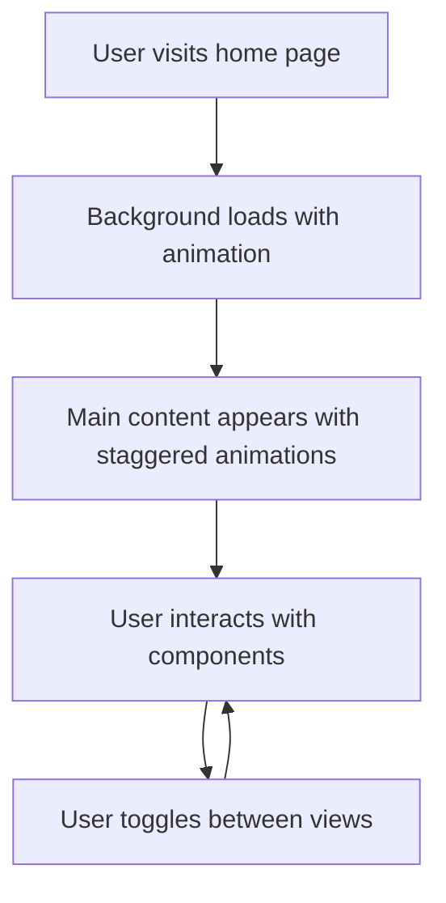

## 1. Product Overview
现代化个人主页，提供美观的用户界面和流畅的动效体验
- 主要目的是展示个人信息、社交链接和常用功能，为用户提供便捷的访问体验
- 目标用户为个人网站所有者和访问者，提升个人品牌形象和用户体验

## 2. Core Features

### 2.1 User Roles
| Role | Registration Method | Core Permissions |
|------|---------------------|------------------|
| Visitor | No registration required | Browse and use all functions |

### 2.2 Feature Module
1. **Home page**: personal information section, social links, functional tools, site links

### 2.3 Page Details
| Page Name | Module Name | Feature description |
|-----------|-------------|---------------------|
| Home page | Personal information section | Display logo, site name, and personal description with animated effects |
| Home page | Social links | Show social media links with hover animations |
| Home page | Functional tools | Provide quick access to common tools and utilities |
| Home page | Site links | Display frequently visited websites with organized categories |
| Home page | Background | Dynamic background with smooth transitions |
| Home page | Mobile menu | Responsive menu for mobile devices |

## 3. Core Process
1. User visits the home page
2. Background loads with animation
3. Main content appears with staggered animations
4. User interacts with various components (social links, tools, etc.)
5. User can toggle between different views and functionalities

## 4. User Interface Design
### 4.1 Design Style
- Primary colors: #3B82F6 (blue), #10B981 (green)
- Secondary colors: #8B5CF6 (purple), #F59E0B (orange)
- Button style: Rounded corners, subtle shadows, hover effects
- Font: Inter (body), Pacifico (display)
- Layout style: Card-based with generous spacing, asymmetric balance
- Icon style: Modern, minimal, with subtle animations

### 4.2 Page Design Overview
| Page Name | Module Name | UI Elements |
|-----------|-------------|-------------|
| Home page | Personal information section | Logo with subtle rotation animation, site name with typography effects, description with fade-in animation |
| Home page | Social links | Icon buttons with hover scale and color transition effects |
| Home page | Functional tools | Card-based layout with subtle hover lift effects |
| Home page | Site links | Organized categories with smooth expand/collapse animations |
| Home page | Background | Dynamic image with parallax effect and subtle blur |
| Home page | Mobile menu | Smooth slide-in animation with backdrop filter |

### 4.3 Responsiveness
- Desktop-first design with mobile-adaptive layout
- Breakpoints: 1200px, 768px, 480px
- Touch optimization for mobile devices
- Fluid typography and spacing

### 4.4 3D Scene Guidance
Not applicable for this project