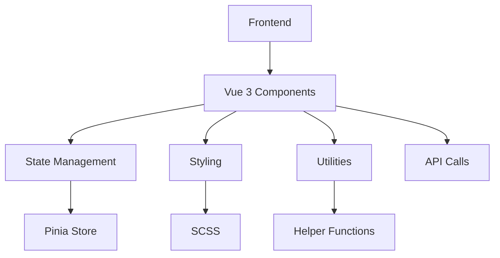

## 1. Architecture Design

## 2. Technology Description
- Frontend: Vue 3 + SCSS + Vite
- Initialization Tool: Vite
- Backend: None
- Database: None

## 3. Route Definitions
| Route | Purpose |
|-------|---------|
| / | Home page with main content |

## 4. API Definitions
Not applicable for this project

## 5. Server Architecture Diagram
Not applicable for this project

## 6. Data Model
Not applicable for this project