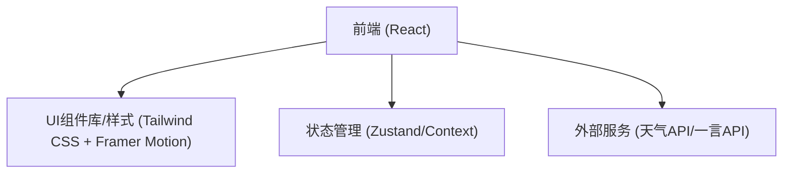

## 1. 架构设计

## 2. 技术说明
- 前端框架: React@18 + Vite
- 样式方案: Tailwind CSS + Framer Motion (用于极简大气的丝滑动画)
- 状态管理: Zustand (替代原有的 Pinia/Vuex)
- 图标组件库: Lucide React (轻量、现代的图标方案)
- 构建工具: Vite

## 3. 路由定义
| 路由 | 目的 |
|------|------|
| / | 唯一的单页主页，承载所有卡片和小组件 |

## 4. API 定义
- GET `https://v1.hitokoto.cn` (获取一言)
- GET 天气 API（复用当前项目配置的高德或和风天气API）
- 数据源：本地配置 JSON（如 `siteLinks.json`, `socialLinks.json`）

## 5. 数据模型
本地状态与静态数据为主，无需复杂的后端数据库。主要状态模型包括：
- `weatherState`: 天气状况、温度、图标等。
- `hitokotoState`: 句子内容和出处。
- `musicState`: 播放状态、当前曲目、音量。
