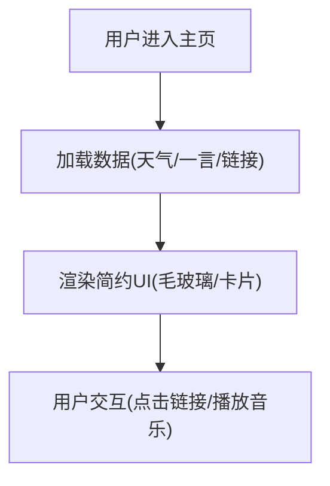

## 1. 产品概述
使用React重构的个人主页，注重美观、简约和大气的设计风格。
- 解决当前Vue版本的风格可能不够现代或不够精致的问题，为目标用户（访客）提供一个视觉享受和快速了解个人的入口。
- 产品目标：展示个人信息、社交链接、常用工具/网站导航，提供一言、天气等小组件功能，并保持极致的响应式和动画体验。

## 2. 核心功能

### 2.1 用户角色
| 角色 | 注册方式 | 核心权限 |
|------|----------|----------|
| 访客 | 无需注册 | 浏览主页信息、使用播放器、查看链接 |

### 2.2 功能模块
1. **主页内容区**: 问候语/个人简介、社交链接、网站导航链接
2. **小组件区**: 时间胶囊、天气信息、一言、音乐播放器入口
3. **全局背景**: 简约大气的动态或静态高质感背景，支持深色/浅色或毛玻璃质感

### 2.3 页面详情
| 页面名称 | 模块名称 | 功能描述 |
|----------|----------|----------|
| 主页 | 问候与社交 | 显示个人Logo/名称，一段简介，以及各种社交媒体图标链接 |
| 主页 | 小组件 | 显示当前时间、天气、一言（随机句子） |
| 主页 | 导航链接 | 分类展示常用的个人站点或工具链接 |
| 主页 | 音乐播放器 | 提供简约的背景音乐播放控制功能 |

## 3. 核心流程
主要为用户访问主页后的浏览体验：

## 4. 用户界面设计

### 4.1 设计风格
- **主色调**：以黑白灰为主的极简色调，搭配少许强调色（如柔和的蓝色或品牌色）。
- **按钮风格**：圆角、毛玻璃（Glassmorphism）效果、微透视、悬浮发光。
- **字体**：无衬线现代字体（如 `Plus Jakarta Sans` 或 `Outfit` 替代常规系统字体），标题可保留 `Pacifico` 等艺术字体。
- **布局风格**：网格化（Bento Grid）或卡片式布局，大留白，呼吸感强。
- **动画**：平滑的过渡动画（Framer Motion），卡片滚动渐显，Hover微交互。

### 4.2 页面设计概述
| 页面名称 | 模块名称 | UI元素 |
|----------|----------|--------|
| 主页 | 整体布局 | 居中或左右分栏布局，毛玻璃卡片，大面积呼吸空间，背景图模糊或微动态 |

### 4.3 响应式设计
桌面端优先，移动端自适应（卡片堆叠），支持触摸优化。

### 4.4 3D 场景指引（如果不适用则忽略）
- **无复杂3D模型**，但可使用CSS 3D变换或动态光晕来增强空间感。
